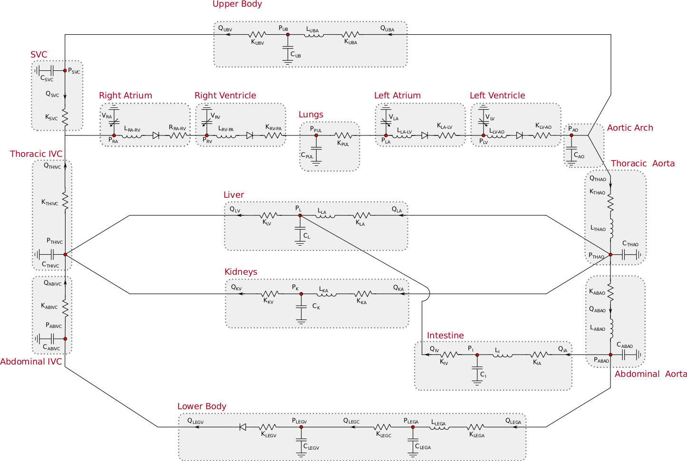
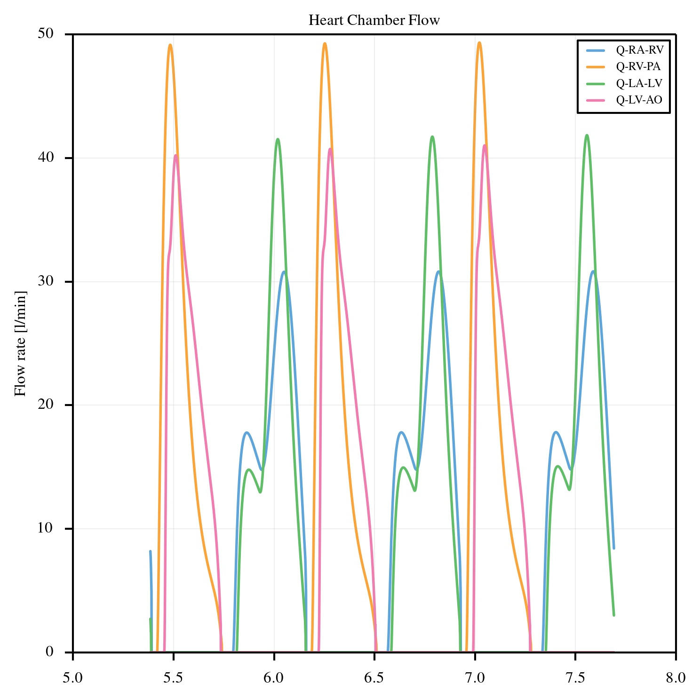
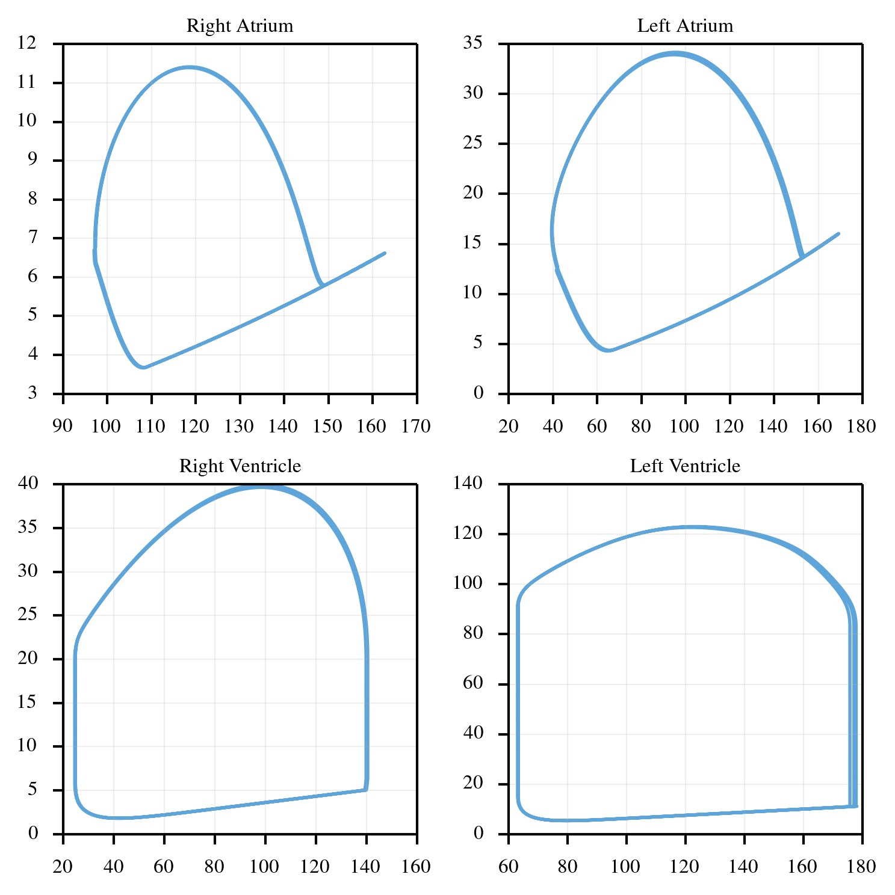
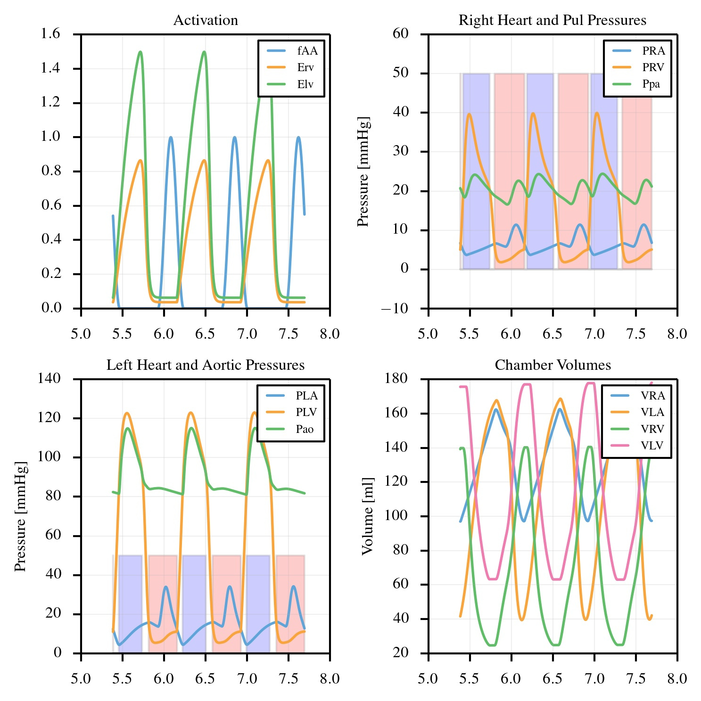
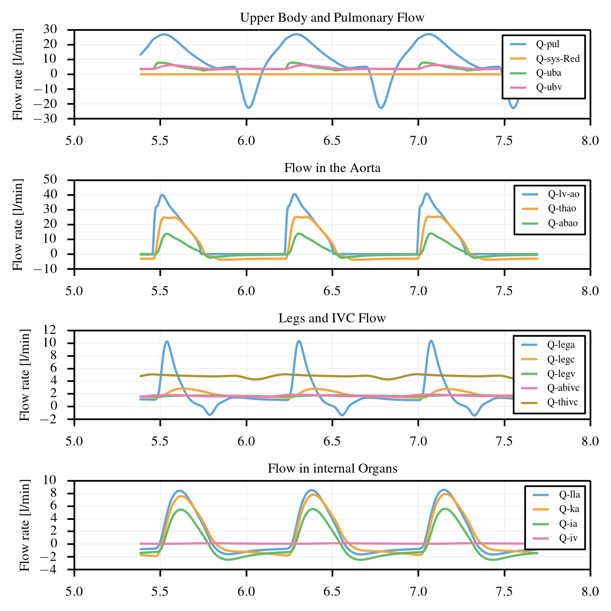
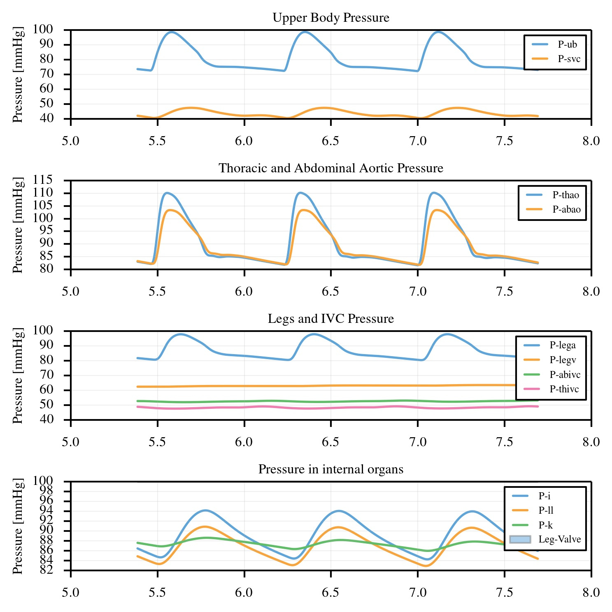

.. _completeLPNModel:

=============================
Normal adult - Complete Model
=============================

This section describes all the components included in the circulation model and associated numerical formulation. 

Preliminaries
^^^^^^^^^^^^^

The circuit layout of the lumped circulation model mimicking the blood circulation in an adult healthy patient is illustrated in the figure below.

   Schematic layout of lamped parameter network model for normal adult subject.

The model includes several compartments:

* **Heart model**: A bi-ventricular heart model is subdivided into four sub-models simulating the right atrium, right ventricle, left atrium and left ventricle. Each sub-model consists of a pressure-volume relationship governing contraction either in terms of an activation or elastance function. The combination of heart chamber and downstream valve is simulated through an assembly of an inductor, a resistor and a diod allowing blood to flow only in one direction.
* **Pulmonary circulation block**: The pulmonary circulation is simulated using one capacitor and one resistor. The effects of respiration are not included in the current formulation. 
* **Upper body block**: Circulation in the upper body is represented through an arterial and venous contribution to the total resistance, while one capacitor is used to represent the overall compliance of the pulmonary circulation. 
* **Lower body block**: The leg circulation block consists of arterial, capillary and venous resistance, a valve and two capacitances for the arteries and veins.
* **Superior Vena Cava**: The Superior vena cava is simulated using an RC block. 
* **Thoracic and Abdominal Inferior Vena Cava**: The thoracic and abdominal inferior vena cava are simulated using two RC blocks. No effect of collapsibility in the inferior vena cava is accounted in the current implementation. 
* **Thoracic and Abdominal Aorta**: These blocks are simulated through RLC equivalent circuits.
* **Internal organs blocks**: Three internal organ blocks are included in the model describing the liver, kidneys and intestine. All organ blocks are simulated using an LRCR circuit where arterial and venous contributions to the total block resistance are separated. 

The varable :math:`t\in[0,t_{max}]` denotes the simulation time with maximum equal to :math:`t_{max}`.
Each heart cycle has a duration of :math:`t_c`.

Model Features
^^^^^^^^^^^^^^

Atrial and ventricular contraction
""""""""""""""""""""""""""""""""""

Total simulation time is monitored through the variable :math:`t\in[0,t_{max}]` while the relative time in the current heart cycle can be determined from :math:`t_{cr} = t\,fmod\,t_c` where :math:`fmod` denotes the floating point reminder operation and each heart cycle has a duration equal to :math:`t_c`.

Atrial contraction is simulated through an activation model characterized by contraction duration and time shift. 
The relative duration of the atrial pulse in the heart cycle is modeled using :math:`t_{sa,s}`, while the absolute atrial contraction time is :math:`t_{sa} = t_c\,t_{sa,s}`.
The beginning of the atrial pulse starts is identified using the time shift parameter :math:`t_{pw}` at :math:`t = t_c - (t_c/t_{p,w})`.

Atrial activation is defined in time using the following expression:

.. math::
   :label: eq3

   \begin{cases}
   f_{AA} = \frac{1}{2}\,\left[1 - \cos\left(\frac{2\pi\,(t_{cr}-t_{pw}+t_{sa})}{t_{sa}}\right)\right] & \mbox{if}\quad  t_{cr} \le t_{pw}, \\[1em]
   f_{AA} = \frac{1}{2}\,\left[1 - \cos\left(\frac{2\pi\,[t_{cr}-t_{pw}-(t_c-t_{sa})]}{t_{sa}}\right)\right]  & \mbox{if}\quad t_{cr}\ge(t_c-t_{sa})+t_{pw}\quad \mbox{and}\quad t_{c,r}<t_c,\\[1em]
   f_{AA} = 0 & \mbox{otherwise}.\\
   \end{cases}

Passive atrial curves are also defined as

.. math::
   \begin{cases}
   P_{pas,ra} & = \lambda_{1,ra}\left[\,e^{\, \lambda_{2,ra}\,(V_{ra}-V_{ra,0})}-1\right],\\[1em]
   P_{pas,la} & =  \lambda_{1,la}\left[\,e^{\, \lambda_{2,la}\,(V_{la}-V_{la,0})}-1\right],
   \end{cases}

where the coefficients :math:`\lambda_{1}`, :math:`\lambda_{2}` govern the slope and exponential increase of the passive curve, respectively and :math:`V_{ra,0}`, :math:`V_{la,0}` denote the unstressed volumes in the right and left atria. 
The active atrial curve is linear with constant slope of :math:`E_{max,ra}` and :math:`E_{max,la}` for the right and left atrium, respectively, according to the following expression:

.. math::
   \begin{cases}
   P_{act,ra} & = E_{max,ra}\,(V_{ra}-V_{ra,0})\\[1em]
   P_{act,la} & =  E_{max,la}\,(V_{la}-V_{la,0})\\
   \end{cases}

Pressure in the atria is bounded by the passive and active pressure, modulated by the activation function:

.. math::
   \begin{cases}
   P_{ra} = P_{pas,ra} + f_{AA}\,(P_{act,ra}-P_{pas,ra}),\\[1em]
   P_{la} = P_{pas,la} + f_{AA}\,(P_{act,la}-P_{pas,la}).\\
   \end{cases}

The mechanism of ventricular contraction is instead modeled using an elastance approach. 
We defined the quantities :math:`E_{rv,s}`, :math:`E_{lv,s}` as the elastance scaling parameter for the right and left ventricle, respectively.

The elastance function and its time derivative is computed from the literature using the parameters :math:`E_{Max} = 2.31`, :math:`E_{Min} = 0.06`, :math:`a_1 = 0.303`, :math:`a_2 = 0.508`, :math:`n_1 = 1.32`, :math:`n_2 = 21.9` and the following expression:

.. math::
   E(t) = E_{Min} + E_{Max}\,\left[\frac{\left(\frac{t_r}{a_1}\right)^{n_1}}{1 + \left(\frac{t_r}{a_1}\right)^{n_1}} \cdot \frac{1}{1 + \left(\frac{t_r}{a_2}\right)^{n_2}}\right]

Elastance functions for the left and right atrium, respectively, are defined as:

.. math::
   \begin{cases}
   E_{rv}(t) = E_{rv,s}\cdot E(t),\\[1em]
   E_{lv}(t) = E_{rv,s}\cdot E(t),\\[1em]
   \end{cases}

Finally, the ventricular pressures are determined using the expressions:

.. math::
   \begin{cases}
   P_{lv} = E_{lv}\,(V_{lv} - V_{lv,0}),\\[1em]
   P_{rv} = E_{rv}\,(V_{lv} - V_{rv,0}).\\
   \end{cases}

with :math:`V_{lv,0}`, :math:`V_{rv,0}` the left and right unstressed ventricular volumes, respectively.

Heart model components including lung circulation
"""""""""""""""""""""""""""""""""""""""""""""""""

The equations for the heart model components (i.e., right atrium, right ventricle, left atrium and left ventricle) are obtained by arranging in series an inductor, a diod and a resistor.
An Heaviside function that governs the opening and closing of heart valves, i.e.

.. math::
   \phi_{i,j} = H(P_i-P_j) = 
   \begin{cases}
   1.0\quad\mbox{if}\quad P_i > P_j\\[1em]
   0.0\quad\mbox{if}\quad P_i < P_j.
   \end{cases}

The evolution of the right atrio-ventricular flow is formulated using:

.. math::
   \frac{dQ_{ra,rv}}{dt} = \phi_{ra,rv}\cdot\frac{1}{L_{ra,rv}}\cdot\left(P_{ra} - P_{rv} - R_{ra,rv}\cdot Q_{ra,rv}\right)

A similar equation can be written for the flow between the right ventricle and the lungs:

.. math::
   \frac{dQ_{rv,pa}}{dt} =  \phi_{rv,pa}\cdot\frac{1}{L_{rv,pa}}\cdot\left(P_{rv} - P_{pa} - R_{rv,pa}\cdot Q_{rv,pa}\right).

The flow in the lungs is:

.. math::
   \begin{cases}
   Q_{pul} &= \frac{P_{pa}-P_{la}}{R_{pul}}\\[1em]
   \frac{dP_{pa}}{dt} &= \frac{1}{C_{pul}} \cdot \left(Q_{rv,pa}\cdot\phi_{rv,pa} - Q_{pul}\right).
   \end{cases}

Similarly, the left atrio-ventricular flow obeys the following expression:

.. math::
   \frac{dQ_{la,lv}}{dt} = \phi_{la,lv}\cdot\frac{1}{L_{la}}\cdot\left(P_{la}-P_{lv} - R_{la,lv}\cdot Q_{la,lv}\right).

Finally, the flow exiting from the left ventricle and entering the aorta is governed by:

.. math::
   \frac{dQ_{lv,ao}}{dt} = \phi_{rv,pa}\cdot\frac{1}{L_{lv,ao}}\cdot (P_{lv}-P_{ao}-R_{lv,ao}\cdot Q_{lv,ao}).

With reference to the figure of the model layout (above), we denoted by :math:`L_{ra,rv}`, :math:`R_{ra,rv}` the inductance and resistance in the right atrium, :math:`L_{rv,pa}`, :math:`R_{rv,pa}` those in the right ventricle. Similarly, :math:`L_{la,lv}`, :math:`R_{la,lv}` denote the inductance and resistance in the left atrium while :math:`L_{lv,ao}`, :math:`R_{lv,ao}` are the same quantities for the left ventricle.

The following equations complete the heart model, relating the time derivative of the atrial and ventricular volumes to the net flow rate across these chambers:

.. math::
   \begin{cases}
   \frac{dV_{ra}}{dt} &= Q_{svc} + Q_{thivc} - Q_{ra,rv} \cdot \phi_{ra,rv}\\[1em]
   \frac{dV_{rv}}{dt} &= Q_{ra,rv} \cdot \phi_{ra,rv} - Q_{rv,pa} \cdot \phi_{rv,pa}\\[1em]
   \frac{dV_{la}}{dt} &= Q_{pul} - Q_{la,lv} \cdot \phi_{la,lv}\\[1em]
   \frac{dV_{lv}}{dt} &= Q_{la,lv} \cdot \phi_{la,lv} - Q_{lv,ao} \cdot \phi_{lv,ao}.
   \end{cases}

Aortic arch capacitance
"""""""""""""""""""""""

The compliance of the aortic arch is denoted by :math:`C_{ao}` and the following equation governs the associated pressure change:

.. math::
   \frac{dP_{ao}}{dt} = \frac{1}{C_{ao}}\cdot \left( Q_{lv,ao} - Q_{uba} - Q_{thao} \right)

Upper Body Circulation
""""""""""""""""""""""

.. math::
   \begin{cases}
   \frac{dQ_{uba}}{dt} = \frac{1}{L_{uba}}\cdot\left(P_{ao} - R_{uba}\cdot Q_{uba} - P_{ub} \right),\\[1em]
   Q_{ubv} = \frac{P_{ub}-P_{svc}}{R_{ubv}},\\[1em]
   \frac{dP_{ub}}{dt} = \frac{1}{C_{ub}} \cdot \left(Q_{uba} - Q_{ubv}\right).
   \end{cases}

Superior Vena Cava
""""""""""""""""""

.. math::
   \begin{cases}
   Q_{svc} = \frac{P_{svc}-P_{ra}}{R_{svc}},\\[1em]
   \frac{dP_{svc}}{dt} = \frac{1}{C_{svc}} \cdot \left(Q_{ubv} - Q_{svc}\right).
   \end{cases}

Thoracic Aorta
""""""""""""""

.. math::
   \begin{cases}
   \frac{dQ_{thao}}{dt} = \frac{1}{L_{thao}}\cdot\left(P_{ao} - R_{thao}\cdot Q_{thao} - P_{thao} \right),\\[1em]
   Q_{abao} = \frac{ P_{thao} - P_{abao} }{ R_{abao} },\\[1em]
   \frac{dP_{thao}}{dt} = \frac{1}{C_{thao}} \cdot \left( Q_{thao} - Q_{abao} - Q_{la} - Q_{ka} \right).
   \end{cases}

Abdominal Aorta
"""""""""""""""

.. math::
   \begin{cases}
   \frac{dQ_{abao}}{dt} = \frac{1}{L_{abao}}\cdot\left(P_{thao} - R_{abao}\cdot Q_{abao} - P_{abao} \right),\\[1em]
   Q_{lega} = \frac{P_{abao}-P_{lega}}{R_{lega}},\\[1em]
   Q_{ia} = \frac{P_{abao}-P_{i}}{R_{ia}},\\[1em]
   \frac{dP_{abao}}{dt} = \frac{1}{C_{abao}} \cdot \left( Q_{abao} - Q_{ia} - Q_{lega} \right).
   \end{cases}

Lower Body Circulation
""""""""""""""""""""""

.. math::
   \begin{cases}
   \frac{dQ_{lega}}{dt} = \frac{1}{L_{lega}}\cdot\left(P_{abao} - R_{lega}\cdot Q_{lega} - P_{lega} \right),\\[1em]
   Q_{legc} = \frac{P_{lega}-P_{legv}}{R_{legc}},\\[1em]
   \frac{dP_{lega}}{dt} = \frac{1}{C_{lega}} \cdot \left( Q_{lega} - Q_{legc} \right),\\[1em]
   Q_{legv} = \frac{P_{legv}-P_{abivc}}{R_{legv}},\\[1em]
   \frac{dP_{legv}}{dt} = \frac{1}{C_{legv}} \cdot \left( Q_{legc} - \cdot \phi_{legv,abivc} \right).
   \end{cases}

Abdominal IVC
"""""""""""""

.. math::
   \begin{cases}
   Q_{abivc} = \frac{P_{abivc}-P_{thivc}}{R_{abivc}},\\[1em]
   \frac{dP_{abivc}}{dt} = \frac{1}{C_{abivc}} \cdot \left( Q_{legv}\cdot\phi_{legv,abivc} - Q_{abivc} \right).
   \end{cases}

Thoracic IVC
""""""""""""

.. math::
   \begin{cases}
   Q_{thivc} = \frac{P_{thivc}-P_{ra}}{R_{thivc}},\\[1em]
   \frac{dP_{thivc}}{dt} = \frac{1}{C_{thivc}} \cdot \left( Q_{abivc} - Q_{thivc} \right).
   \end{cases}

Liver Circulation
"""""""""""""""""

.. math::
   \begin{cases}
   \frac{dQ_{lla}}{dt} = \frac{1}{L_{lla}}\cdot\left( P_{thao} - R_{lla}\cdot Q_{lla} - P_{ll} \right),\\[1em]
   Q_{iv} = \frac{P_{i}-P_{ll}}{R_{iv}},\\[1em]
   Q_{llv} = \frac{P_{ll}-P_{thivc}}{R_{llv}},\\[1em]
   \frac{dP_{ll}}{dt} = \frac{1}{C_{ll}} \cdot \left(Q_{lla} + Q_{iv} - Q_{llv} \right).
   \end{cases}

Circulation in the kidneys
""""""""""""""""""""""""""

.. math::
   \begin{cases}
   \frac{dQ_{ka}}{dt} = \frac{1}{L_{ka}}\cdot\left( P_{thao} - R_{ka}\cdot Q_{ka} - P_{k} \right),\\[1em]
   Q_{kv} = \frac{P_{k}-P_{thivc}}{R_{kv}},\\[1em]
   \frac{dP_{k}}{dt} = \frac{1}{C_{k}} \cdot \left( Q_{ka} - Q_{kv} \right).
   \end{cases}

Circulation in the intestine
""""""""""""""""""""""""""""

.. math::
   \begin{cases}
   \frac{dQ_{ia}}{dt} = \frac{1}{L_{ia}}\cdot\left(P_{abao} - R_{ia}\cdot Q_{ia} - P_{i} \right),\\[1em]
   Q_{iv} = \frac{P_{i}-P_{ll}}{R_{iv}},\\[1em]
   \frac{dP_{i}}{dt} = \frac{1}{C_{i}} \cdot \left(Q_{ia} - Q_{iv}\right).
   \end{cases}

Default model parameters
^^^^^^^^^^^^^^^^^^^^^^^^

The following table lists the initial conditions adopted for the state variables

==================== ====== =================
Variable             Unit   Initial condition
==================== ====== =================
:math:`V_{ra}`       ml     0.0
:math:`V_{la}`       ml     0.0
:math:`V_{rv}`       ml     0.0
:math:`V_{lv}`       ml     0.0
:math:`Q_{ra,rv}`    ml/s   0.0
:math:`P_{pa}`       mmHg   70.0
:math:`Q_{rv,pa}`    ml/s   0.0
:math:`Q_{la,lv}`    ml/s   0.0
:math:`P_{ao}`       mmHg   100.0
:math:`Q_{lv,ao}`    ml/s   0.0
:math:`P_{ub}`       mmHg   50.0
:math:`Q_{uba}`      ml/s   0.0
:math:`P_{svc}`      mmHg   10.0
:math:`Q_{thao}`     ml/s   0.0
:math:`P_{thao}`     mmHg   120.0
:math:`P_{abao}`     mmHg   120.0
:math:`Q_{abao}`     ml/s   0.0
:math:`P_{i}`        mmHg   50.0
:math:`P_{lega}`     mmHg   50.0
:math:`P_{abivc}`    mmHg   50.0
:math:`P_{legv}`     mmHg   50.0
:math:`Q_{lega}`     ml/s   0.0
:math:`P_{thivc}`    mmHg   10.0
:math:`Q_{lla}`      ml/s   0.0
:math:`P_{ll}`       mmHg   120.0
:math:`Q_{ka}`       ml/s   0.0
:math:`P_{k}`        mmHg   120.0
:math:`Q_{ia}`       ml/s   0.0
==================== ====== =================
  
Atrial model parameters and heart rate
""""""""""""""""""""""""""""""""""""""

============================================================================= ========== =================
Variable                                                                      Unit       Initial condition
============================================================================= ========== =================
HR - Heart Rate                                                               bpm        78.0
:math:`t_{sa}` - Atrial relative activation duration                          -          0.4
:math:`t_{pw}` - Atrial relative activation time shift                        -          9.5 
:math:`\lambda_{1,ra}` - Atrial passive curve slope, right atrium             -          4.0
:math:`\lambda_{2,ra}` - Atrial passive curve exponent factor, right atrium   -          0.006 
:math:`E_{max,ra}` - Atrial active curve slope, right atrium                  Barye/ml   0.1 
:math:`V_{ra,0}` - Unstressed right atrial volume                             ml         0.0 
:math:`\lambda_{1,la}` - Atrial passive curve slope, left atrium              -          8.0 
:math:`\lambda_{2,la}` - Atrial passive curve exponent factor, left atrium    -          0.0065 
:math:`E_{max,la}` - Atrial active curve slope, left atrium                   Barye/ml   0.5
:math:`V_{la,0}` - Unstressed left atrial volume                              ml         0.0 
============================================================================= ========== =================

Ventricular model parameters
""""""""""""""""""""""""""""

======================================================================== ========== =================
Variable                                                                 Unit       Initial condition
======================================================================== ========== =================
:math:`E_{rv,s}` - Right Ventricular Elastance Scaling Factor            -          0.6
:math:`E_{lv,s}` - Left Ventricular Elastance Scaling Factor             -          1.04
:math:`E_{lvp,s}` - Left Ventricular Elastance Derivative Scaling Factor -          6.0 
:math:`V_{rv,0}` - Unstressed right ventricular volume                   ml         0.0 
:math:`V_{lv,0}` - Unstressed left ventricular volume                    ml         0.0 
======================================================================== ========== =================
  
Atrial and Ventricular Inductances and Resistances
""""""""""""""""""""""""""""""""""""""""""""""""""

======================================================================== ===================== =================
Variable                                                                 Unit                  Initial condition
======================================================================== ===================== =================
:math:`L_{ra,rv}` - Inductance of right atrium                           Barye s :math:`^2`/ml 0.1 
:math:`R_{ra,rv}` - Resistance of right atrium                           Barye s/ml            20.0 
:math:`L_{rv,pa}` - Inductance of right ventricle                        Barye s :math:`^2`/ml 0.1 
:math:`R_{rv,pa}` - Resistance of right ventricle                        Barye s/ml            30.0 
:math:`L_{la,lv}` - Inductance of left atrium                            Barye s :math:`^2`/ml 0.1 
:math:`R_{la,lv}` - Resistance of left atrium                            Barye s/ml            50.0 
:math:`L_{lv,ao}` - Inductance of left ventricle                         Barye s :math:`^2`/ml 0.1 
:math:`R_{lv,ao}` - Resistance of left ventricle                         Barye s/ml            20.0 
======================================================================== ===================== =================

Peripheral model properties
"""""""""""""""""""""""""""

====================================================================== ====================== =================
Variable                                                               Unit                   Initial condition
====================================================================== ====================== =================
**Pulmonary Circulation**                                              -                      -
:math:`C_{pa}` - Pulmonary capacitance                                 mmHg/ml                5.0
:math:`R_{pa}` - Pulmonary resistance                                  Barye s/ml             50.0 
**Aortic Arch**                                                        -                      -
:math:`C_{ao}` - Aortic capacitance                                    mmHg/ml                0.5
**Upped Body Circulation Parameters**                                  -                      -
:math:`L_{uba}` - Upper body arterial inductance                       Barye s :math:`^2`/ml  0.1 
:math:`R_{uba}` - Upper body arterial resistance                       Barye s/ml             200.0 
:math:`C_{ub}` - Upper body compliance                                 Barye/ml               100.0e-6 
:math:`R_{ubv}` - Upper body venous resistance                         Barye s/ml             700.0 
**Superior Vena Cava**                                                 -                      -
:math:`C_{svc}` - Compliance of SVC                                    Barye/ml               400.0e-6 
:math:`R_{svc}` - SVC Resistance                                       Barye s/ml             50.0 
**Thoracic Aorta**                                                     -                      -
:math:`L_{thao}` - Inductance of thoracic aorta                        Barye s :math:`^2`/ml  1.0 
:math:`R_{thao}` - Resistance of thoracic aorta                        Barye s/ml             15.0 
:math:`C_{thao}` - Capacitance of thoracic aorta                       Barye/ml               300.0e-6; 
**Abdominal Aorta**                                                    -                      -
:math:`R_{abao}` - Resistance of abdominal aorta                       Barye s/ml             50.0 
:math:`L_{abao}` - Inductance of abdominal aorta                       Barye s :math:`^2`/ml  1.0 
:math:`C_{abao}` - Capacitance of abdominal aorta                      Barye/ml               100.0e-6
**Legs**                                                               -                      -
:math:`L_{lega}` - Inductance of leg arteries                          Barye s :math:`^2`/ml  0.1 
:math:`R_{lega}` - Resistance of leg arteries                          Barye s/ml             100.0
:math:`C_{lega}` - Capacitance of leg arteries                         Barye/ml               450.0e-6 
:math:`R_{legc}` - Resistance of leg capillary circulation             Barye s/ml             1000.0 
:math:`C_{legv}` - Capacitance of leg venous circulation               Barye/ml               6000.0e-6 
:math:`R_{legv}` - Resistance of leg venous circulation                Barye s/ml             500.0 
**Abdominal IVC - Inferior Vena Cava**                                 -                      -
:math:`C_{abivc}` - Capacitance of abdominal IVC                       Barye/ml               500.0e-6 
:math:`R_{abivc}` - Resistance of abdominal IVC                        Barye s/ml             200.0 
**Thoracic IVC**                                                       -                      -
:math:`C_{thivc}` - Capacitance of thoracic IVC                        Barye/ml               500.0e-6 
:math:`R_{thivc}` - Resistance of thoracic IVC                         Barye s/ml             700.0
**Liver**                                                              -                      -
:math:`L_{lla}` - Inductance of Liver arterial circulation             Barye s :math:`^2`/ml  10.0 
:math:`R_{lla}` - Resistance of Liver arterial circulation             Barye s/ml             200.0 
:math:`C_{ll}` - Capacitance of Liver circulation                      Barye/ml               1890.0e-6 
:math:`R_{llv}` - Resistance of Liver venous circulation               Barye s/ml             2000.0 
**Kidneys**                                                            -                      -
:math:`L_{ka}` - Inductance of arterial circulation in the Kidneys     Barye s :math:`^2`/ml  10.0 
:math:`R_{ka}` - Resistance of arterial circulation in the Kidneys     Barye s/ml             200.0
:math:`C_{k}` - Capacitance of circulation in the Kidneys              Barye/ml               7200.0e-6 
:math:`R_{kv}` - Resistance of venous circulation in the Kidneys       Barye s/ml             2000.0 
**Intestine**                                                          -                      -
:math:`L_{ia}` - Inductance of arterial circulation in the Intestine   Barye s :math:`^2`/ml  10.0 
:math:`R_{ia}` - Resistance of arterial circulation in the Intestine   Barye s/ml             200.0 
:math:`C_{i}` - Capacitance of circulation in the Intestine            Barye/ml               1130.0e-6 
:math:`R_{iv}` - Resistance of venous circulation in the Intestine     Barye s/ml             2000.0 
====================================================================== ====================== =================

Model solution with default parameter set
^^^^^^^^^^^^^^^^^^^^^^^^^^^^^^^^^^^^^^^^^

   
   Atrial and ventricular activation (top left). Pressures in the right atrium, right ventricle and lung circulation (top left). Pressures in the left atrium, left ventricle and aorta (bottom left). Atrial and ventricular volumes (bottom right).

   Atrial and ventricular Pressure-Volume loops.

   Flow in the heart chambers.

   Flow rates in peripheral circulation.

   Pressures in peripheral circulation.
