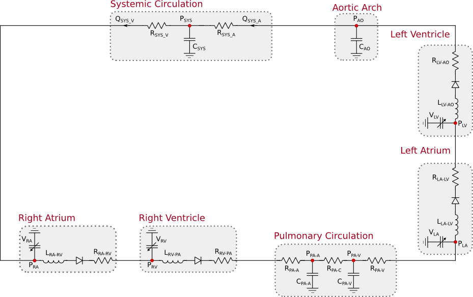
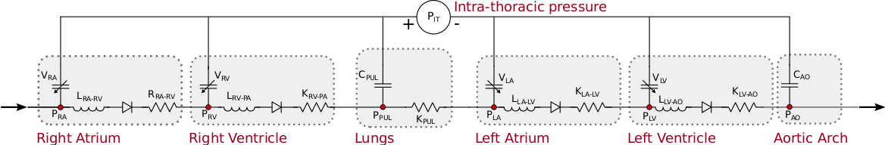
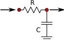
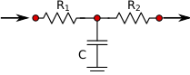
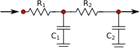
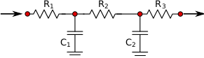
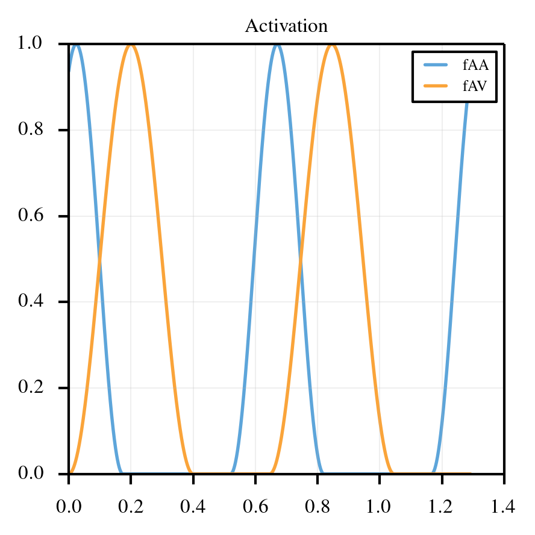
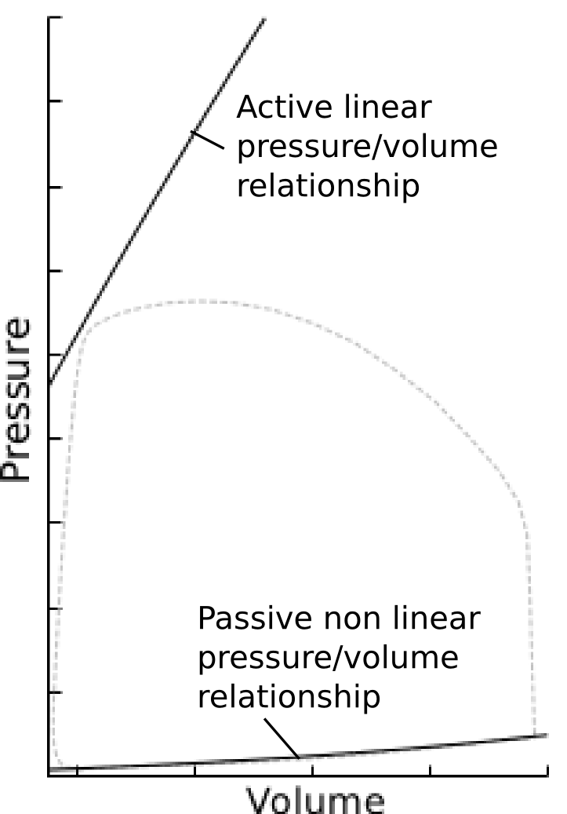
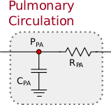
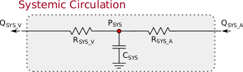

.. _simpleLPNModel:

===============================
Normal adult - Simplified Model
===============================

This section discusses the simplified formulation for a LPN layout characterizing blood circulation in adult subjects. 
This model is derived from :ref:`the complete model <completeLPNModel>`where a single RCR block mimics the systemic circulation.

The model consists of seven compartment: 

* **Left Atrium** - The left atrium simulated using an activation formulation, followed by an inductance element, a perfect valve and a resistance element.
* **Left Ventricle** - The left ventricle simulated using an activation formulation, with associated inductance, valve and resistance.
* **Aortic Arch** - A capacitor to simulate the thoracic aortic compliance.
* **Systemic circulation** - A simple description of the systemic circulation represented through the arterial and venous resistance and systemic capacitance.
* **Right Atrium** - The right atrium simulated using an activation formulation, followed by an inductance element, a perfect valve and a resistance element.
* **Right Ventricle** - The right ventricle simulated using an activation formulation, with associated inductance, valve and resistance.
* **Pulmonary Circulation** - An block providing a simplified representation of the pulmonary resistance and compliance.

.. note:: 

   **Activation formulation** - Atrio-ventricular contraction is modeled using a *activation* formulation. This allows to separately account for an **active** and **passive** pressure-volume relationships and therefore to independently account for reductions in these two quantities typically associated with systolic and diastolic heart failure, respectively. 

.. warning::

   **Models PA and PD for the pulmonary circulation compartment** - To study the effects of a varying complexity in modeling the pulmonary circulation blocks, most of the computations are performed on two models at the same time. The first model identified as **PA** (pulmonary layout A) includes a RC description of the pulmonary circulation. The second model **PD** (pulmonary layout D) uses a richer RCRCR description instead. 

.. figure:: imgs/simple_NA/Circuit_Normal_Simple.png
   :width: 80%
   :align: center

   Model with RC pulmonary circulation layout (**PA**)

   Model with RCRCR pulmonary circulation layout (**PD**)

Assumptions
^^^^^^^^^^^

The simplified LPN circulation model discussed in this section, contains the following assumptions:

* **Perfect valves**. No regurgitation is assumed in the valves (mitral, aortic, tricuspid and pulmonary). The status of each valve is either *open* or *closed*.
* **No baroreflex** mechanism is considered in this simple model. This relates to the short-term systemic arterial pressure control in man and mammals, carried out by a sophisticated feedback system :cite:`ursino1998interaction`. This mechanism regulates acute pressure changes and therefore is not considered as a contributor of chronic elevated pulmonary pressures (group II pulmonary hypertension). 
* **Atrial fibrillation** - A LPN model simulates the blood circulation in adults from a mere *hemodynamic* perspective. Electro-physiological mechanics, for example those governing atrial and ventricular polarization/depolarization are therefore not considered. In this context, atrial fibrillation is an **electrical signal propagation dysfunction** and therefore not directly simulated in the proposed circulation models. However, the *effect* of AFib could be accounted for in several ways:

  * By setting the **atrial activation function to zero** in order to eliminate the contribution of atrial contraction to ventricular filling. 
  * Use a **sinusoidal activation function** of lower intensity and frequency determined through an analysis of the ECG signal. 
  * Approach from :cite:`scarsoglio2014impact` :

    * A **large number of heart cycles** are simulated for improved QoI statistics convergence. 
    * The heart cycle duration is extracted from an **exponentially modified Gaussian** distribution.
    * Constant right and left atrial elastance. The activation function for the two atria is **zero** for the whole duration of the heart cycle. 
    * **LV contractility is reduced**, based on the duration of the preceding (:math:`t_{rr,1}`) and pre-preceeding (:math:`t_{rr,2}`) heart beat, as follows:

.. math::
  E_{lv,max} = 0.59\,\frac{t_{rr,1}}{t_{rr,2}} + 0.91 \,\mbox{[mmHg/ml]}

* **Effects of respiration** not considered in the current study. Abnormal respiration can be a consequence of congestive heart failure (see, e.g., :cite:`lieber1992cheyne`) and can contribute to further stressing the failing heart, but is likely not a possible cause. Respiration was included in :cite:`snyder1969computer` and coupled to vein collapsibility as follows:
  
  * Intra-thoracic pressure source  connected in series with all the capacitances of vessels contained in the thoracic cavity (see figure below). 
  * Intra-thoracic pressure tracings shown in :cite:`snyder1969computer`. Inspiration and expiration are assumed of equal duration and the intra-thoracic **pressure amplitude** is assumed to vary between -2.0 and -5.0 mmHg.

   Possible model modification with pressure source connected to thoracic capacitances

* We have considered various degrees of complexity in modeling the pulmonary and systemic circulation blocks. Four model layouts were initially considered where the systemic and pulmonary circulations are characterized by RC, RCR, RCRC and RCRCR arrangements, respectively. The **simplest RC and most complex RCRCR** models were finally chosen. All tests in the following sections are performed using these two models .

   Model **PA**

   Model **PB**

   Model **PC**

   Model **PD**

Model Formulation
^^^^^^^^^^^^^^^^^

Activation Function
"""""""""""""""""""

As discussed above, an activation formulation is preferred to an elastance formulation to be able to directly model atrial and ventricular ESPVR/EDPVR and changes in these quantities produced by chronic heart failure. 

.. math::
  A_V=
  \begin{cases}
      \left[1-cos\left(\frac{2\pi t_{mv}}{t_{svs}}\right)\right]/2, & \text{if } t_{mv}<t_{svs}\\[.5em]
      0,              & \text{otherwise}
  \end{cases}\\
  \quad
  A_A=
  \begin{cases}
     \left[1-cos\left(\frac{2 \pi t_{ma}}{t_{sas}}\right)\right]/2, & \text{if } t_{ma}<t_{sas}\\[.5em]
      0,              & \text{otherwise}
  \end{cases}

where :math:`t_{ma}` and :math:`t_{mv}` are relative cycle-times measured from the beginning of atrial and ventricular activation, and :math:`t_{sas}` and :math:`t_{svs}` are the total atrial and ventricular activation times, respectively. 

   
   Graphical representation of atrial and ventricular activation functions :math:`A_A`, and :math:`A_V`

Atrium and ventricle models
"""""""""""""""""""""""""""

The pressure-volume relationship in the generic heart chamber is determined using:

.. math::
   \begin{cases}
   P_{*,act} = E_{max,*}\,(V_{*}-V_{*,0}),\\[10pt]
   P_{*,pas} = K^1_{*,pas}\,\left[e^{\,K^2_{*,pas}(V_{*}-V_{*,0})}-1\right],\\[10pt]
   P_{*} = A_{*}\,P_{*,act} + P_{*,pas},
   \end{cases}

where * stands for RA,RV,LA or LV. It can be seen how an active and passive pressure-volume ratios are first defined and the pressure oscillates between these two, depending on the activation function values.

   
   Graphical representation of active and passive pressure-volume curves for a generic hear chamber

Heart chambers, valves, peripheral circulation
""""""""""""""""""""""""""""""""""""""""""""""

If we denote :math:`P_{ds}` and :math:`P_{us}` as the pressure downstream and upstream of a generic **heart chamber**, the following equations govern the fluid motion across this chamber. The equilibrium of forces, in the inductance :math:`L` can be written as:

.. math::
  \begin{cases}
  \frac{dQ}{dt} = 0 \quad \text{if}\quad P_{ds} > P_{us}\\[10pt]
  \frac{dQ}{dt} = \frac{\left(P_{us} - P_{ds} - R\,Q\right)}{L}\quad \text{if}\quad P_{ds} \le P_{us}.\\[10pt]
  \end{cases}

   Schematic layout of generic heart chamber. Main components are the resistance, inductance and valve.

Similarly, a generic **peripheral** circulation block typically consists of an assembly of capacitances and resistances and can be formulated using the continuity of flow rates, as follows:

.. math::
   \frac{dP}{dt} = \frac{1}{C}\,\left( Q_{us} - Q_{ds} \right);

   Generic pulmonary model compartment

   Generic systemic model compartment
